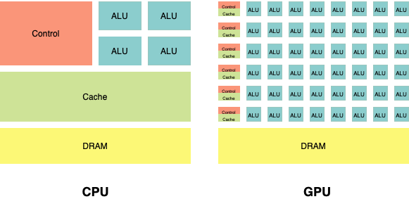

# What is a GPU? Are They Needed for Deep Learning? 

A graphics processing unit (GPU) is a specialized electronic circuit designed to rapidly manipulate and alter memory to accelerate the creation of images in a frame buffer intended for output to a display device.

A GPU, short for graphics processing unit, is a computer chip that performs rapid mathematical equations for the purpose of rendering images.Specific or integrated may be part of a graphics card.

### **Comparison GPU vs CPU**

📋 Enter the **GPU_Usage.ipynb** file for colab notebook.